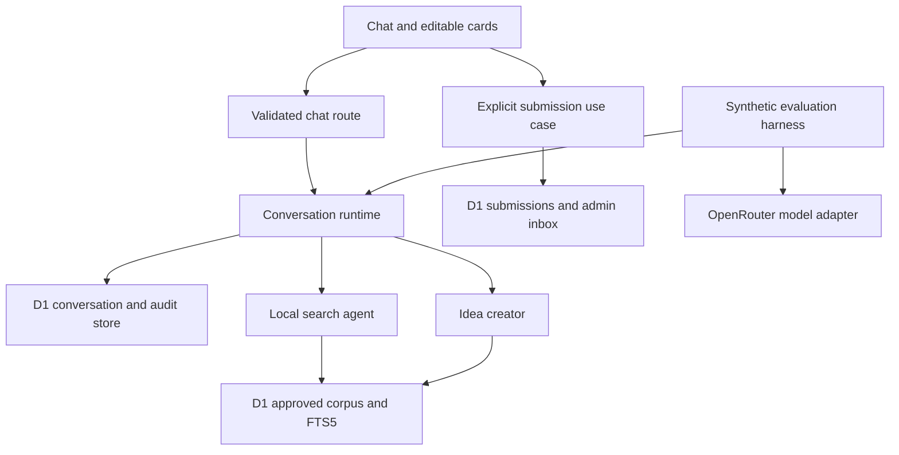

# Hubmi architecture and research

Prepared 3 October 2026. This document defines a chat application for Małopolski Hub Innowacji Społecznych, using the challenge PDF, the existing Hubmi repository, aiwise, and current primary documentation. It is a design deliverable; application implementation and paid model evaluations are outside this pass.

Keep the existing Next.js, Cloudflare Workers, D1 and Drizzle stack. Build two agents around one conversation runtime. The latest user instruction selects `google/gemini-3.1-flash-lite` through OpenRouter for all model-backed functionality, superseding the earlier local-only search and DeepSeek model choice. Chat text is therefore transmitted to OpenRouter for inference. Business actions remain restricted by application permissions. The current chat now uses this model; the full two-agent runtime below remains the implementation plan.

## Agreed product decisions

| Decision | Status |
| --- | --- |
| Two agents | Confirmed: search and Kreator pomysłów. |
| Current chat memory | Confirmed: remember earlier messages in the open chat. Reload starts a new conversation. |
| Historical conversations | No user history list or restoration across reload. All accepted conversations and messages remain in D1. |
| Model and inference | Latest decision: Gemini 3.1 Flash Lite through OpenRouter for all model-backed functionality. User text may be sent for inference; search has no business mutation tools. |
| Idea creation | Confirmed: extract the Social Canvas from natural-language input, ask follow-up questions, then show a confirmation component. |
| Disconnect | Confirmed: stop execution and save the interrupted turn. |
| Deliverable | Confirmed: architecture and research first, without implementation. |
| Creator inference | Use the same shared Gemini model factory as the search chat. |
| Source dataset | Confirmed: use a small part of one report from the ROPS reports page. |
| Confirmation destination | Confirmed: submit the reviewed Social Canvas to the admin inbox. |

“Local” means inside the approved Hubmi deployment, including its Cloudflare D1 binding. It does not mean offline browser execution or privately owned hardware. This trust scope must be revisited if the hosting requirement changes.

The PDF requires social matchmaking and describes knowledge resources, idea creation, testing, communication, an administrator panel and innovation adaptation. This MVP covers matchmaking, knowledge presentation and idea creation. A small administrator inbox is proposed for submissions. Grant application generation, mentor messaging, tester workflows and Middleman Innowacji remain later work. The PDF asks for WCAG 2.1 AA and excludes real personal or sensitive data from the supplied challenge materials. Source: [challenge PDF](/home/michal/Downloads/hubmi.pdf).

## Existing implementation

Hubmi already uses Next.js 16.3.8, React 19.2.8, OpenNext, Workers, D1, Drizzle, AI SDK 7.0.127 and the OpenRouter provider 3.1.0. The UI uses a streaming HTTP endpoint backed by Gemini with schema-validated final output. The runtime saves normalized conversations, user and assistant messages, timing, browser metadata, model calls and tool calls in D1. Deterministic adapter, D1 integration and browser tests exercise progressive output before provider completion. See [streaming implementation](streaming.md).

Keep the existing `domain/`, `application/` and `infrastructure/` organization. The HTTP route composes a per-request D1 store and model adapter; the hardcoded matcher has been replaced. Existing sample telephone numbers, addresses and distance claims must not become verified recommendations merely because they are already in code.

## Agent behavior and permissions

| Agent | Behavior | Permitted operations |
| --- | --- | --- |
| Search and matchmaking | Use Gemini and approved evidence to understand the current need; planned retrieval adds matching innovations, source cards and justified charts. | External model inference and reads of approved corpus/statistics. No message sending, submission or arbitrary URL fetching. |
| Kreator pomysłów | Extract Social Canvas fields from the initial description; ask focused follow-up questions; maintain a reviewed canvas and offer final confirmation. | Read approved materials and update a private draft. Explicit finalization/submission goes through a separate application use case. |

Conversation and diagnostic writes are runtime responsibilities, not agent-granted business permissions. The read-only search agent still has its conversation saved to D1 as required.

Use one shared model factory for search, canvas extraction, follow-up questions and optional evaluations: `infrastructure/ai/openrouter.ts`. Its model ID is fixed to `google/gemini-3.1-flash-lite`; provider errors do not silently select another model or return fabricated fallback answers. [OpenRouter model reference](https://openrouter.ai/google/gemini-3.1-flash-lite).

Use minimal thinking. In one comparison using the same synthetic Polish question and the application's structured-response pipeline, DeepSeek V4.1 Flash took 49.4 seconds, Gemini 2.5 Flash Lite 3.7 seconds and Gemini 3.1 Flash Lite with minimal thinking 2.8 seconds. These are single observations, not representative latency guarantees or quality benchmarks. A deployed browser test also observed a successful DeepSeek response after 41 seconds; indefinite loading was not reproduced during a successful response, but a deliberately stalled browser request reproduced the missing client deadline.

The model adapter now has a 30-second deadline, and the browser has an independent 45-second deadline. The latter aborts the streaming HTTP request and clears pending UI. Runtime logging records response timing and failures in D1; interrupted turns preserve the received partial answer.

Use an explicit agent selector. Proposed default: switching agents opens a fresh conversation, preventing accidental context sharing. A reviewed idea/source card can be deliberately carried into a new chat as typed input later. Shared infrastructure does not imply two agents run simultaneously or call one another.

Enforce capabilities in the runtime and dependency wiring. Search receives the model adapter and approved retrieval, but no mail adapter, submission adapter or arbitrary fetch tool. An attempted forbidden operation fails before execution and is logged. Tests intercept the OpenRouter transport and verify model selection, request shape, response validation and failures without credentials or network calls.

## Runtime and module interfaces



The conversation runtime is a deep module: callers submit a turn and consume typed events, while the implementation owns authorization, idempotency, ordering, context, execution, persistence and completion. Tests use the same interface as the route. Avoid a public method for every internal processing stage.

Proposed external interface:

```ts
type SendTurn = {
  conversationId: string;
  requestId: string;
  messageId: string;
  text: string;
};
// Authenticated conversation capability is provided separately by the route.
interface ConversationRuntime {
  send(input: SendTurn): AsyncIterable<ChatEvent>;
}
```

Internal seams are justified by concrete variation: local retrieval versus a fixture corpus; D1 versus a lightweight fake for pure tests; scripted model versus OpenRouter for synthetic evaluations; real clock versus deterministic clock. Both agents use the shared model adapter; retrieval and model transport are separately replaceable for deterministic tests.

Suggested implementation locations:

| Location | Responsibility |
| --- | --- |
| `domain/chat/` | Turn states, capabilities, card and chart schemas. |
| `application/chat/` | Conversation runtime, context compiler and submission use case. |
| `infrastructure/chat/` | D1 adapter, OpenRouter adapter and typed transport. |
| `infrastructure/knowledge/` | Corpus ingestion, FTS retrieval and source validation. |
| `app/api/chat/route.ts` | Validation, capability check, event streaming. |
| `components/chat/` | Transcript, status, cards and reveal buffer. |
| `tests/` and `evals/` | Deterministic tests and synthetic live evaluations. |

## Conversation identity and lifetime

Create a fresh conversation capability when the page opens, held in memory. Its opaque credential authorizes current-chat operations; possession of a conversation ID alone must not authorize access. On reload, issue a new conversation rather than restoring from local storage. Current-chat context comes from D1, not a client-supplied transcript. A browser session may span conversations for diagnostics without making old transcripts available to the UI.

The client sends the latest message and stable IDs only. The server rejects unknown or unauthorized conversations, oversized messages, changed payloads using the same idempotency key, and overlapping turns. One active turn per conversation is a product invariant, enforced in D1 rather than relying on the send button.

## D1 storage without transcript duplication

Each logical message has one canonical row. Streaming updates that row or its typed parts. Never insert the whole conversation again on every send, store repeated prompt snapshots, or save one cumulative response per token.

| Table | Data and invariants |
| --- | --- |
| `browser_sessions` | Browser family/version, platform, locale, timezone, viewport class and application version; capture once, update changes explicitly. |
| `conversations` | Session reference, agent, creation/end time, current sequence, active run and capability digest. |
| `turns` | Request ID, payload hash, input/output message references, status, timing and lease deadline. Unique conversation plus request ID. |
| `messages` | Conversation, sequence, role, status, timestamps. Unique conversation plus sequence; stable message ID. |
| `message_parts` | Ordered text, source references, cards, charts and structured tool exchanges. Update the same text part during checkpoints. |
| `model_calls` | Turn/step/attempt, model and actual provider, parameters, prompt version, context references/hash, token counts, timing, cost and normalized errors. Record every actual model call. |
| `tool_calls` | Stable call ID, validated arguments, outcome, bounded result/reference, timing and errors. |
| `run_events` | Typed lifecycle and diagnostic events with stable event IDs. No repeated transcript or secrets. |
| `prompt_versions` | Immutable instructions, tool schema version and hash, saved once per version. |
| `sources` and `source_versions` | Approved URL, corpus version, checksum, publication date, locality, page/section and extracted content. |
| `idea_drafts` and `idea_submissions` | Mutable draft versions and an immutable approved submission snapshot with revision reference. |

Add foreign keys, uniqueness constraints, indexes on conversation sequence and run status/deadline, and schema checks for supported states. Use D1 transactional batches for atomic acceptance and finalization; do not assume a traditional interactive SQL transaction works through Drizzle's D1 adapter. [D1 batch behavior](https://developers.cloudflare.com/d1/worker-api/d1-database/).

Admission should claim a conversation through a conditional database update, allocate a monotonically increasing sequence, and insert the turn, user message and assistant placeholder atomically. A failed claim must make the complete batch fail; a zero-row conditional update alone is not sufficient. Prototype and test this D1-specific admission operation before building the agent loop. Enforce uniqueness as a final safeguard.

For repeated request IDs, identical payloads return the existing turn; changed payloads return a conflict. An explicit regeneration creates another assistant attempt associated with the existing user input, rather than inserting the user text again. Model retries receive separate call rows and never erase failed attempts.

On acceptance, save the user input and assistant placeholder before executing work. For buffered model responses, save complete canonical output before revealing it. For future model streams, checkpoint received partial text with increasing revision numbers, then atomically commit final content, terminal status and timing before emitting `complete`. Reject older checkpoint revisions so delayed writes cannot overwrite final content.

“All saved” cannot mean crash-proof preservation of every received token with periodic checkpoints. A process crash can lose the uncheckpointed tail. Proposed guarantee: every accepted turn, user message, assistant placeholder, committed partial output and terminal state is recorded; unacknowledged input can be retried. If every shown token must survive crashes, persist deltas before releasing them to the browser and measure the additional latency/write volume.

D1 supports FTS5. Each database has finite capacity and throughput; bounded writes and indexed reads matter. Propose a retention policy before production, and measure storage per conversation rather than assuming indefinite retention fits one database. [SQL support](https://developers.cloudflare.com/d1/sql-api/sql-statements/), [D1 limits](https://developers.cloudflare.com/d1/platform/limits/).

## Context and prompt construction

Use one context compiler for model-enabled execution and evaluation. Local agents consume an analogous typed current-chat context without serializing prompts. Persisted data is canonical; presentation animation, status labels and diagnostic logs never become conversational content.

For model calls, assemble one instruction block, permitted tool descriptions and schemas, bounded source evidence, complete earlier turns, current draft state where relevant, and the current user message exactly once. Instructions repeat once per independent provider request because those requests need their instructions; they must not be embedded in every historical message or copied into message rows.

Keep complete structured tool call/result groups with IDs and outcome states. Treat retrieved text as untrusted evidence. Never promote document instructions into the system role. Tool definitions accompany continuation requests too. [OpenRouter tool calling](https://openrouter.ai/docs/guides/features/tool-calling).

Budget instructions, tool schemas, source evidence, retained turns and output reserve before each model step. Trim complete older turns, preserving recent user constraints and explicit draft state. If essential current input cannot fit, ask for a shorter input rather than silently truncating it. Use provider-aware token estimates and record estimates separately from reported usage.

Store reproducible context manifests containing message/part revisions, selected source versions, tool schema hash and prompt version. Keep immutable revisions where references alone would otherwise point to changed draft data. Do not duplicate the entire serialized prompt per call. Read primary/consistent D1 state for context; if replicas are introduced, use sessions/bookmarks. [D1 sequential consistency](https://developers.cloudflare.com/d1/best-practices/read-replication/).

## Retrieval and source grounded visualization

Start with an approved corpus ingested independently of user queries. Public website access during ingestion does not authorize sending user queries to those sites. The user selected a small part of one report from the [ROPS reports page](https://rops.krakow.pl/badania-analizy-raporty/raporty-z-badan). Keep that subset separate from synthetic test records and from an eventual verified innovation catalog.

Use D1 FTS5, metadata filters and a curated Polish synonym dictionary. Normalize diacritics and word variants deliberately; build safe FTS expressions instead of accepting raw user syntax. Rank candidate innovations using topic, beneficiary, location and implementation-stage evidence. Store match reasons and limitations. Lexical relevance is not a calibrated probability.

Benchmark Polish inflection, synonyms, indirect descriptions, follow-up references and geographic scope before choosing embeddings. External embedding of a user query would violate the confirmed search privacy rule. A future semantic adapter must execute inside the approved infrastructure.

The downloaded report is *Usługi społeczne w Małopolsce – deficyty, potrzeby, potencjał rozwojowy. Zaktualizowane wnioski z diagnozy*, published by ROPS in 2025 under CC BY 4.0. Only five facts from pages 25–26 are selected for the prototype:

| Selected fact | Period and scope |
| --- | --- |
| 841,500 residents aged 60+, representing 24.5% of the population | 2024, Małopolska |
| 147,000 residents aged 80+, representing 17.5% of seniors | 2024, Małopolska |
| 7,420 recipients of municipal care services | 2024, Małopolska |
| 15 municipalities, or 8.2%, did not organize their own care services | 2024, Małopolska |
| Neighbour-care services reached 228 people in 35 municipalities | 2024, Małopolska |

Source: [ROPS report download](https://rops.krakow.pl/pliki-do-pobrania/wpis,2025-uslugi-spoleczne-w-malopolsce-deficyty-potrzeby-potencjal-rozwojowy-zaktualizowane-wnioski-z-diagnozy,1348). The [local source notes](research/sources/rops-2025-uslugi-spoleczne-diagnoza.notes.json) preserve pages, provenance and units; the PDF is retained for verification, while only these facts are proposed for the runtime corpus. These figures do not establish present service availability, individual eligibility or a comparable denominator between demographic and service counts. Do not chart them as mutually exclusive categories.

This is a small knowledge demonstration, not yet a verified catalog of matching innovations. ROPS search results also identify the [innovation library](https://rops.krakow.pl/innowacje-spoleczne/biblioteka-innowacji-spolecznych/kategorie) and [social challenges map](https://rops.krakow.pl/pliki-do-pobrania/artykul%2Cmapa-wyzwan-spolecznych%2C1048), but their actual content was not inspected. A verified innovation dataset remains necessary to prove matchmaking. Clearly labelled synthetic innovations can exercise that functionality during development.

Return a closed vocabulary of typed artifacts: innovation cards, comparison tables, idea cards and bar/line charts. Chart values, units, periods, geographic coverage and source IDs come from stored facts. Validate source references and schema before rendering. Never generate executable HTML/JavaScript as a visualization. Provide textual/table alternatives and direct citations. If no numeric evidence exists, show cards rather than inventing a chart.

## Social Canvas dialogue and confirmation

Use the actual [ROPS Social Canvas](https://rops.krakow.pl/mpliki/IS/Moj_folder/INNO_AGH_-_SOCIAL_CANVAS.pdf), rather than inventing a generic idea form. It is a three-page visual worksheet, version 1.0 dated 5 May 2026, with no interactive PDF fields. The application needs its own typed schema and accessible editable review. PDF export would require overlay/rendering, not filling existing AcroForm fields. The fetch succeeded through ordinary public HTTP after the browser tool failed.

The [verified field map and dialogue contract](research/social-canvas-fields.md) defines each section and its constraints:

| Page | Sections |
| --- | --- |
| 1 | Problem intensity/frequency/scale; supporters and obstacles; solution value versus cost/readiness/clarity; fixed and variable costs. |
| 2 | Users, payers and decision makers; primary and growth income; emotional and functional value, at most three priorities each. |
| 3 | Direct/intermediary/additional channels; partners with contribution areas and relationship status; separate person/community/environment impact. |

Do not replace this with a conventional nine-block business canvas. Keep independent ratings separate and suggested partners distinct from confirmed ones. The original repeats a direct-channel heading over its intermediary section; use clear application labels while retaining the source mapping.

Start with the user's free description. Extract every supported field for which the description provides evidence, preserve the original message reference, and ask a small focused follow-up question for the most consequential missing or ambiguous field. Re-extract from the answer together with the current canvas state; do not restart the interview or ask for information already supplied. Distinguish explicit facts, provisional interpretations, suggestions, contradictions and unknowns. Do not invent budgets, confirmed partners, achieved impact or funding commitments.

The dialogue uses typed transitions: `collecting`, `needs_clarification`, `ready_for_review`, `confirmed` and, where applicable, `submitted`. A model proposes a validated patch; application code applies it against the current draft revision. It cannot approve or submit its own proposal. Manual edits are authoritative. Show uncertainties in the review instead of hiding them behind invented numerical confidence scores.

The final confirmation component presents all canvas sections with edit controls, highlights unresolved fields, describes the exact action, and provides an explicit confirm button. Changing any field invalidates the previous confirmation revision. Allow an explicitly incomplete draft where the product permits it; a valid finalized canvas and a saved draft are different outcomes.

Submission is a dedicated application operation invoked by a visible button after the user reviews the exact canvas. A conversational “yes” must not authorize submitting a different draft later. Bind submission to the displayed revision/hash, scoped confirmation token and an idempotency key. Atomically save the immutable snapshot and admin inbox entry, then show a durable receipt. Identical retries return the existing receipt; altered requests or stale revisions fail.

The existing `ContactDialog` is a UI mock: it flips local state to show that a coordinator received the request, but performs no persistence or delivery. Reuse its visual patterns only after implementing the real confirmation use case; do not copy that success behavior or its promised response time.

Confirmed destination: a ROPS admin inbox. Proposed implementation: authenticated list/detail/status views with no outbound email initially. Protect all admin reads server-side; an unlinked URL is not authentication. End-user accounts are unnecessary for ephemeral public chat. Whether contact details, a return receipt, or a response channel is required remains a product decision; fresh chats cannot support asynchronous dialogue on their own.

## Streaming and smooth reveal

The implemented NDJSON protocol uses `start`, `text`, `complete` and `error`. Text events carry cumulative readable snapshots from partial model output, while `complete` carries the validated final answer and artifacts. The browser animates received text independently; it does not wait for model completion. The request ID identifies the turn, and sequential D1 writes preserve published ordering.

Separate received canonical content from displayed content. Use elapsed time and backlog to set a bounded reveal speed, segment Polish text and emoji by grapheme, and render complete structured artifacts atomically. Proposed starting settings are a short initial buffer and at most two seconds of reveal backlog; tune using UX measurements. These are design targets, not measured performance claims.

Avoid stacking server delay on client animation. AI SDK `smoothStream` provides chunking and delay, but not adaptive browser pacing. [SDK smoothing](https://ai-sdk.dev/docs/reference/ai-sdk-core/smooth-stream).

Provide reduced-motion behavior, preserve focus, avoid forcing scroll while the user reads older text, and announce completed messages/status changes rather than every token. Use a named log and polite status region. Charts need accessible alternatives. W3C documents [chat logs](https://www.w3.org/WAI/WCAG22/Techniques/aria/ARIA23) and [status messages](https://www.w3.org/WAI/WCAG21/Understanding/status-messages). Reduced-motion support is a product choice beyond claiming every animation setting is an AA requirement.

## Failure handling and logging

Confirmed MVP lifecycle: disconnect stops request-bound work; save an interrupted turn and its committed partial output. Explicit cancellation is a separate event. Do not keep generating after reload by accident. A reconciler closes runs whose persisted lease expired after a crash, with an interruption reason rather than fabricated completion.

Cloudflare allows only a limited continuation window after disconnect; `waitUntil` and SDK `consumeStream` are not durable execution guarantees. If background completion becomes a requirement, add a Workflow/Queue-owned run and a separate delivery channel. [Worker lifetime](https://developers.cloudflare.com/workers/runtime-apis/context/), [SDK persistence](https://ai-sdk.dev/docs/ai-sdk-ui/chatbot-message-persistence).

Record acceptance time, retrieval time, model start/first output/completion where applicable, storage time, browser first display/final reveal, tool outcomes and normalized errors. Browser reports are untrusted telemetry, separate from authoritative server outcomes. Browser data means agreed diagnostic fields, not arbitrary device inspection. Exclude secrets, authorization headers and accidental repeated prompt bodies.

Critical persistence failures prevent a success receipt. D1 outages can also prevent logging the error to D1: this is a material limit, not something to swallow. A separate durable outbox can retain bounded diagnostic events for idempotent ingestion after recovery. Queue delivery is at least once; event IDs prevent duplicate stored effects. [Queue delivery](https://developers.cloudflare.com/queues/reference/delivery-guarantees/).

## Lessons from aiwise

| Reference | Reuse | Change for Hubmi |
| --- | --- | --- |
| `apps/backend/lib/chat.ts` | D1 history; input saved before inference; explicit sequence. | Add idempotency, atomic admission and assistant placeholders/checkpoints. |
| `apps/backend/lib/ai.ts` | Central instructions/context assembly; budgets per tool step. | Preserve complete typed tool history and budget whole turns. |
| `apps/backend/lib/research.ts` | Bounded tools, cancellation and corpus-aware cache. | Include agent, permissions and resolved context in cache identity; avoid follow-up collisions. |
| `apps/backend/lib/public-reply.ts` | Validate final public output. | Typed grounded cards/charts; choose buffered reveal deliberately. |
| `packages/widget/src/utils/useSmoothText.ts` | Received/displayed separation, backlog acceleration, reduced motion. | Deterministic elapsed-time scheduling; avoid random reveal increments. |
| `packages/widget/src/state/useChat.ts` | Abort/reset and stale callback protection. | Require explicit terminal event; EOF alone is not success. |
| `apps/backend/lib/trace.ts` and `turn-trace.ts` | Shared typed execution/evaluation diagnostics. | Do not silently discard persistence failures or use its 500-trace pruning policy. |
| `apps/backend/tests/conversation-history.test.ts` | Test actual routes/storage with model seam replaced. | Add duplicate/concurrent requests, tool context and crash states. |
| `apps/backend/benchmark/harness/runner.ts` | Same execution pipeline for evaluations; checkpoints and cost/latency. | Version every input; preserve failed attempts and accurate cost completeness. |

Aiwise currently consumes the model privately and publishes one validated final text chunk. Its widget then animates the result. Its history truncation and assistant persistence only at finalization are unsuitable for Hubmi's stronger recording requirements. These findings are from source inspection, not a live benchmark run.

## Deterministic tests and model evaluations

Functional tests must assert effects through real module interfaces. A mock returning a successful answer cannot prove retrieval, storage or tool execution works.

| Test layer | Required evidence |
| --- | --- |
| Local retrieval | Fixed Polish corpus returns expected source IDs for topic, beneficiary, locality and follow-up queries; empty results are honest. |
| Context | Earlier user/assistant messages preserved; latest input once; one instruction block; complete tools/descriptions; no browser diagnostics or cross-conversation data. |
| D1 integration | Real migrations, duplicate requests, changed-payload conflicts, concurrent admission, sequence, partial checkpoints, finalization rollback and immutable submission. |
| Runtime | Exercise actual orchestration with scripted model responses; real permitted tool executes; forbidden and invalid calls fail without side effects. |
| Output | Citation IDs resolve; chart numbers equal source records; malformed artifacts and unsafe markup fail validation. |
| Transport and UI | Slow/burst/stalled streams, explicit completion, early EOF, abort, stale callbacks, exact final content, graphemes, reduced motion and scroll behavior. |
| Privacy | Only the approved model transport and retrieval are available; credentials and browser fields are absent from generated context and logs. |

Use AI SDK v7 `MockLanguageModelV4` for compatible model contract tests, inspecting actual model requests rather than replacing the whole agent runtime. [AI SDK testing](https://ai-sdk.dev/docs/ai-sdk-core/testing). Run D1-specific tests in a Workers-compatible environment with real migrations; current Cloudflare docs recommend their Vitest integration. [Workers tests](https://developers.cloudflare.com/workers/testing/vitest-integration/).

Proposed scripts for the implementation phase: `test`, `test:integration`, `test:e2e`, `eval:openrouter`. Deterministic tests plus existing lint/type checks gate changes. Live evaluation remains opt-in, with no paid calls in ordinary CI.

Synthetic live evaluations run the same orchestration and tool adapters against a fixture corpus and disposable database. Load `OPENROUTER_API_KEY` only for explicit local evaluations; ordinary CI runs pure tests with fixture transport. Use the shared fixed Gemini model ID. Never commit the key or send real stored conversations in evaluations. A synthetic live request validated the new adapter separately from CI.

Use `google/gemini-3.1-flash-lite` for evaluations as well as production model calls. Record routing, supported schema/tool parameters and an evaluation spend ceiling. [OpenRouter model](https://openrouter.ai/google/gemini-3.1-flash-lite), [provider routing](https://openrouter.ai/docs/guides/routing/provider-selection).

Evaluation fixtures should include Polish synonyms, no matching evidence, second-turn references, unrelated documents containing instructions, fabricated source IDs, invalid tool arguments, denied mutation attempts, idea edits and ambiguous submission requests. Score schema/citation validity, retrieved IDs, validated tool arguments, actual tool outcomes and final stored effects. Grade usefulness separately with a small human rubric. Exact prose matching is unsuitable.

Proposed first evaluation: 20 scenarios with three repetitions after a low-cost connectivity smoke test. Report all attempts, pass rates, latency and cost; do not retry until a pass hides failure. Store prompt/tool/corpus hashes, model/provider/settings and SDK versions. Model evaluations do not replace deterministic retrieval, persistence and UI tests.

## Implementation sequence and open decisions

1. Settle contact/receipt requirements and the agent-switch proposal. Keep all inference on the shared Gemini model.
2. Build real D1 migrations, admission/idempotency operations and integration tests. Prove canonical storage before agent development.
3. Ingest a small approved corpus; create fixed Polish retrieval cases; implement local search and grounded cards.
4. Add current-chat context and idea drafts with schema validation and revision handling.
5. Add explicit submission and the agreed administrator access path.
6. Add typed transport, smooth reveal, error states and accessibility checks.
7. Add optional OpenRouter synthetic evaluations and compare model/tool behavior using recorded results.

Do not introduce a vector database, agent framework or Durable Object without evidence that local retrieval, the small runtime interface or D1 admission cannot meet measured requirements. Revisit those choices when Polish retrieval quality, concurrency, latency or background completion demands it.

Before production, settle retention/deletion, expected traffic and support ownership. Monthly cost depends on D1 rows scanned/written, stored corpus/log volume, Worker requests/execution and any approved inference. Measure Gemini input/output usage and actual routing prices for the operating budget. Quote an operating budget only after measuring a representative conversation and choosing a traffic estimate.
